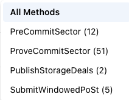

# Polkadot Native Storage: Solution

- [1 Libraries to be forked](#1-libraries-to-be-forked)
- [2 Libraries to be ported](#2-libraries-to-be-ported)
- [3 Actors and Pallets](#3-actors-and-pallets)
- [4 JSON-RPC](#4-json-rpc)
- [5 Markets](#5-markets)
- [6 Implement from scratch](#6-implement-from-scratch)
- [7 XCM: Integration with Polkadot](#7-xcm-integration-with-polkadot)

# 1 Libraries to be forked

Two Rust libraries comprise Filecoin's storage-proof system. We can basically use them as is. Filecoin uses them in their applications written in Go via CGO + FFI.  These libraries will be part of `polka-store`, more details [here](#61-polka-store)

## 1.1 [`rust-fil-proofs`](https://github.com/filecoin-project/rust-fil-proofs)

From the readme:  "The Filecoin Proving Subsystem (or FPS) provides the storage proofs required by the Filecoin protocol. It is implemented entirely in Rust, as a series of partially inter-dependent crates – some of which export C bindings to the supported API."


The proofs produced are 192 bytes in length, which corresponds to 130M constraints. A Proof of Replication contains 10 SNARKs, providing proofs for the 1.3G constraints required for 32GiB sectors.


## 1.2 [`bellperson`](https://github.com/filecoin-project/bellperson)

This is a crate for creating zk-SNARK proofs with Groth16. Support for GPU parallel acceleration to the FFT and Multiexponentation algorithms is included out of the box, via compilation to CUDA and OpenCL.

## 1.3 [`storethehash`](https://github.com/vmx/storethehash)

This Rust library served as an early iteration of Filecoin's [`storetheindex`](https://github.com/ipni/storetheindex), an indexer service which we believe could be used as a basis upon which to build `polka-index`, our own indexer (discussed in [section 6.2](./new-solution.md#62-polka-index)).

Content indexing and discovery is a complex topic, for which there are several possible architectures.  It is important to get scalability and performance in balance. Caching also plays a role for content that is often requested.


## 1.4 [`rs-graphsync`](https://github.com/retrieval-markets-lab/rs-graphsync)

This library is a Rust implementation of the GraphSync protocol. This protocol is used to transfer content between systems, for retrieval.

This is the [Go version used by Filecoin](https://github.com/ipfs/go-graphsync).   

Another option would be to consider a simpler HTTP protocol.


# 2 Libraries to be ported


## 2.1 [`dagstore`](https://github.com/filecoin-project/dagstore)


This is one of the libraries that we recommend to be ported from Go to Rust. It is a major piece of functionality in the Filecoin ecosystem, being the code that stores Filecoin pieces.

We believe that having the library running in native Rust is a good investment of resources, and would be a boon to the crypto community.  The Go code consists of 42 files, 4634 lines-of-code.


# 3 Actors and Pallets

Filecoin employs actors and their respective methods to run their ecosystem from within the Filecoin Virtual Machine (FVM). These objects essentially map directly to Substrate pallets and extrinsics.  Both are Rust libraries compiled to WebAssembly, and both are run in a VM.  One strategy we propose, is to bring the Filecoin actors directly into a collator node.

# 3.1 `builtin-actors`

This is a [Rust library](https://github.com/filecoin-project/builtin-actors) used by the Filecoin VM to power their VM. The on-chain built-in actors are compiled to WASM, and run from within the Filecoin Virtual Machine (see their [reference implementation](https://github.com/filecoin-project/ref-fvm))


They will form the basis of the pallets used by Polkadot Native Storage (PNS).  Filecoin actors operate very similarly to Substrate pallets. These are Filecoin entities, listed with their Substrate equivalents.

```
Filecoin  ->  Substrate
_________________________
actor     ->  pallet
method    ->  extrinsic
message   ->  transaction
```

While we will not be porting them  *per se*, they will have to be significantly adapted for use in Substrate.

The methods and parameter structures provide a specification of the end result, so the development phase here should be correspondingly shortened.

An additional resource would also be a full enumeration of all structures used in the Filecoin blockchain at the Sentinel site where Lily data dumps are created.  Having these as a model could shorten the time of porting Go to Rust.
- Actors: https://lilium.sh/data/actors/    
- Chain data: https://lilium.sh/data/chain/

They are used to generate blockchain snapshot, that may be downloaded here: https://lilium.sh/data/dumps/  


## 3.2 Pallets

While this is not meant to be a complete listing of all the extrinsics that will eventually be accessible, these are some of the more common methods that are seen in typical blocks on the Filecoin blockchain.  
\
The following four methods account for more than 98% of all messages executing on Filecoin.  


- Miner
  - `PreCommitSector`
  - `SubmitWindowedPoSt`
  - `ProveCommitSector`
- Market
  - `PublishStorageDeals`

This is a typical distribution of messages in a block, grabbed from the Filecoin block scanner:

<p align="center">
  
</p>

It is important that not every method exposed by the pallet need to be extrinsic. Only actions that produce a state change (transaction) need to be treated as extrinsic and put in the pallet with some weight (fee for executing it). Other pallets can expose some functions that can be called internally by other pallets without the possibility to call them by the parachain user, just to divide the responsibility between pallets.

### 3.2.1 The miner pallet

These four extrinics have been implemented in our demo pallet:
- `change_worker_address`
- `change_peer_id`
- `change_owner_address`
- `confirm_update_worker_key`

They've been updated from the CGS code, and some of their parameters have been changed to match the Filecoin actor messages. In fact, `pallet-pns-common` contains definitions for some of their parameters, moved from the FVM code as-is, to prove that it's possible to use FVM parts to speed up the development process (like the whole Filecoin `Address` module).

The first three correspond to the following Filecoin actor messages:
```
ChangeWorkerAddress = 3,
ChangePeerID = 4,
ChangeOwnerAddress = 23,
```
#### 3.2.1.1 Methods

These are examples of the data structures used with some of the miner actor messages.

Name: `DeclareFaultsRecovered`  
Params:
```
{
  "Recoveries": [
    {
      "Deadline": 1,
      "Partition": 0,
      "Sectors": "66,84,85,92,93,95,102,103, ..."
    }
  ]
}
```

Name: PreCommitSector  
Params:
```
{
  "SealProof": 8,
  "SectorNumber": 10266,
  "SealedCID": "bagboea4b5abcbunob34vedkjyzavz52jmi544t7rmk2xu37qmermgnorol3htoqi",
  "SealRandEpoch": 3212441,
  "DealIDs": [54785735],
  "Expiration": 4757180,
  "ReplaceCapacity": false,
  "ReplaceSectorDeadline": 0,
  "ReplaceSectorPartition": 0,
  "ReplaceSectorNumber": 10266
}
```

Name: `ProveReplicaUpdates`  
Params: 
```
{
  "Updates": [
    {
      "SectorID": 5970,
      "Deadline": 2,
      "Partition": 0,
      "NewSealedSectorCID": "bagboea4b5abcapnhm5ixdynkld7dohj6o3klxwdjsgxd4b4wnnkqbed7bio6xgiz",
      "Deals": [54790140],
      "UpdateProofType": 3,
      "ReplicaProof": "0x8b0595b5c5027690b3c2f..."
    }
  ]
}
```

Name: ProveCommitSector  
Params:
```
{
  "SectorNumber": "43374",
  "Proof": "0x929b6852f56181a3a..."
}
```
Note: The proof here is 1920 bytes, or `10 * 192`, 192 being the length of a single zk-SNARK proof.  Each proof is for a 130M constraint part of the proof, of which ten are required for a 32GB sector


Name: `SubmitWindowedPoSt`  
Params: 
```
{
  "Deadline": 44,
  "Partitions": [
    {
      "Index": 0,
      "Skipped": ""
    }
  ],
  "Proofs": [
    {
      "PoStProof": 13,
      "ProofBytes": "0x8cda9442b59777a037c987bc111a6d7db38b7e0ebb24e7c336b995ad2ebd4be9b06519ec575690078f1e8c860e80294aaff42d9a72712f12ff132c4e4b260211482e11e1379c9ca9f986d81957eabbe3e287a1bc8238b7b0107ef248e4d696b10c65e6f3c9ab92c25ffcfed8602116c4c74a448428266d4424d54ca0b3f082c01aff85e5cf1047091da55c383d60c571a8f442b029c2859192dfab37966eb3750ed21ab5e5ffacfe6a5ca0c28f61580643812456b05204736f76ed39a1ea6dce"
    }
  ],
  "ChainCommitEpoch": "3213663",
  "ChainCommitRand": "0x3a7a835524a317d9e80238709717ee9221addf4e643b26a65665e634af7def3e"
}
```
Note: the proof size is 192 bytes.


### 3.2.2 The market pallet

This actor is responsible for processing and managing on-chain deals.
- it is the entry point of all storage deals and data into the system.
- maintains a mapping of StorageDealID to StorageDeal
- keeps track of locked balances of storage client and storage provider
- restores collateral to the client if the provider gets slashed


#### 3.2.2.1 Methods

Name: AddBalance  
Params: none  
Notes: This extrinsic is just an array of from/to transactions

Name: WithdrawBalance  
Params:
```
{
    "AmountRequested": "138000000000000000000"
}
```

Name: PublishStorageDeals  
Params:
```
{
  "Deals": [
    {
      "Proposal": {
        "PieceCID": "baga6ea4seaql42omoabvlx3yean24ehj7spyrvsrzmd5r22cxhd6kc3z2pdrsey",
        "PieceSize": 34359738368,
        "VerifiedDeal": true,
        "Client": "f1f5edx6ofn3lf6rk3yfpldbi2pzgq2egoyu6ubpi",
        "Provider": "f01832632",
        "Label": "mAXCg5AIguGuz88IXudDd62xPn6wLKjWaWhmReXTOaaGSuLU3bVY",
        "StartEpoch": "3228071",
        "EndEpoch": "3746471",
        "StoragePricePerEpoch": "0",
        "ProviderCollateral": "7863774879987970",
        "ClientCollateral": "0"
      },
      "ClientSignature": {
        "Type": 1,
        "Data": "0xfaa730dd21f0a627064d6603b34cf1b30d88fb29cafa78dc900cf7804aff72b75f1841b2e0254743bafa581f735ad92d4bd0370f2d3c5919770fb9970d735fc501"
      }
    }
  ]
}
```
Notes: This is transaction typically contains several deals.


### 3.2.3 The power pallet

Besides maintaining the per-miner power state, this pallet is responsible for creating a miner.

These two extrinics have been implemented in our demo pallet:
- `create_miner`
- `update_claimed_power`

They correspond to the following actor messages:
```
CreateMiner = 2,
UpdateClaimedPower = 3,
```

That pallet also uses `pallet-pns-common` to demonstrate the usage of standard FVM type definition in WASM environment. As the same types are shared between `pallet-miner` and `pallet-power`, it shows not only FVM compatibility but also cooperation between different actors (pallets) in the parachain environment.


## 3.3 Alternative: bring the entire FVM into a pallet

Instead of creating a pallet for each actor, mirroring the structure of the FVM, an alternative strategy would be to compile the entire FVM into a pallet.  This would mirror how the [Polkadot Frontier](https://github.com/paritytech/frontier) project implemented the EVM for Polkadot.

Setting aside several WASM incompatibilities for a moment, there are a number of points to support this approach
- you get the blockchain state serialization out-of-the-box.
- several complex libraries are already part of the FVM
  - IPLD
  - blockstore

However, other libraries are not compilable to a WebAssembly target.  These are mainly the storage proof libraries, which demand multi-core CPU as well as GPU capabilities.  For example:
```
[dependencies]
bellperson = { version = "0.26", default-features = false }
bincode = "1.1.2"
blstrs = "0.7"
lazy_static = "1.2"
filecoin-proofs-v1 = { package = "filecoin-proofs", version = "~16.0.0", default-features = false }
filecoin-hashers = { version = "~11.0.0", default-features = false, features = ["poseidon", "sha256"] }
fr32 = { version = "~9.0.0", default-features = false }
storage-proofs-core = { version = "~16.0.0", default-features = false }

[features]
default = ["opencl", "cuda"]
cuda = ["filecoin-proofs-v1/cuda", "filecoin-hashers/cuda", "storage-proofs-core/cuda", "bellperson/cuda"]
cuda-supraseal = ["filecoin-proofs-v1/cuda-supraseal", "filecoin-hashers/cuda", "storage-proofs-core/cuda-supraseal", "bellperson/cuda-supraseal"]
opencl = ["filecoin-proofs-v1/opencl", "filecoin-hashers/opencl", "storage-proofs-core/opencl", "bellperson/opencl"]
multicore-sdr = ["filecoin-proofs-v1/multicore-sdr"]
```


They would need to be called via the JSON-RPC interface of the `polka-store` process, which does the heavy computation for the miners.

Which approach should be taken will require additional research that is beyond the scope of this proposal.  In particular, how the EVM was implemented for Polkadot should be studied in depth, comparing it to the Filecoin VM and its own technical requirements.

## 3.4 Off-chain workers

One additional Polkadot feature we can take advantage of is [off-chain workers](https://docs.substrate.io/learn/offchain-operations/).  We would avail ourselves of this for longer running and possibly non-deterministic tasks.

They are still WebAssembly modules, so we cannot run multi-threaded or GPU-dependent code.  Nevertheless, it would be another tool available to us, given a relevant context.


# 4 JSON-RPC

Filecoin's JSON-RPC API is a major component of their system.  It is the interface to the blockchain state itself, as well as miners, storage market, rewards, etc.  Storage clients may directly interact with the blockchain via the `Client` API, for example, to request a quote for a storage deal.

## 4.1 API

The API calls are implemented in the `lotus` application in Go.  Much of this functionality would have to be ported from Go to Rust.

It would require a research task to specify:
- what subset of API calls to keep,
- which calls to eliminate,
- new Polkadot-specific calls.

While there is a lot of freedom here, the Filecoin JSON-RPC API is a useful starting point.


Some example categories and some representative calls are listed here:

```
Chain
  ChainGetBlockMessages
  ChainGetBlock
  ChainGetMessage

Client
  ClientQueryAsk
  ClientStartDeal
  ClientListDeals
  ClientGetDealStatus

Market
  MarketAddBalance
  MarketWithdraw

State
  StateMinerSectors
  StateMinerProvingDeadline
  StateMinerInfo
  StateMinerDeadlines
  StateMinerPartitions
  StateMinerAvailableBalance
  StateSectorGetInfo
  StateMarketDeals
  StateListMiners

Sync
  SyncSubmitBlock
  SyncIncomingBlocks
  SyncValidateTipset
```
There are several other modules
- `Eth`: ethereum calls
- `Gas`
- `Mpool`: message pool
- `Msig`: multisig wallets
- `Paych`: payment channels for off-chain transactions
- `Wallet`

## 4.2 Storage and Retrieval Markets

Much of the code for the storage and retrieval markets are in separate Go libraries:
- [retrieval market](https://github.com/filecoin-project/go-fil-markets/tree/master/retrievalmarket)
- [storage market](https://github.com/filecoin-project/go-fil-markets/tree/master/storagemarket)

This functionality must be folded into both the RPC handlers and relevant actors.  See also [Section 5](#5-markets) that follows for a more in-depth discussion.

There are generally two ways of moving forward with RPC implementation: 
1. allow each actor (pallet) to handle his own RPC calls and expose the RPC endpoint to the `node`
2. put every call to one pallet (`pallet-pns`), which will handle all RPC calls and will be exposed to the `node` and forward calls to the right actors

We've left the decision for the future, as it's not a priority at the moment. The first option is more flexible and seems to be right from the architectural point of view, as each actor is fully handling everything about its functionality. It introduces simple responsibility and simplifies updating because, in case of any changes, only one actor (pallet) must be updated. On the other hand, keeping all RPC calls in the main pallet allows handling them in one place and presenting them to the user consistently. It also introduces some level of abstraction, where we can make some additional tasks before redirecting the call to the destination pallet.

For the demo, we've implemented the RPC endpoint in the `pallet-pns` with some simple calls returning hardcoded values. It just presents how the RPC endpoint works and how it can be plugged into the runtime from the pallet level. Calls can be easily moved to the actors and be handled from the other pallet - as well as adding new RPC endpoints to the other pallets by analogy.

# 5 Markets

Filecoin has two markets on its platform: one for storage and one for retrieval.  
- In the case of storage, deals are recorded on-chain.  
- In the case of retrieval, deals are set up off-chain, between a client and a retrieval market provider. The payments are also executed off-chain, via a payment channel.
- the protocols execute over `libp2p`


## 5.1 Storage Market

### 5.1.1 How to store a file with Filecoin

There are four basic steps to setting up a storage deal: discovery, negotiation, publish, and handoff.

- Discovery: The client identifies miners and determines their current asks, i.e. the price per GiB per epoch that miners want to receive in order to accept a deal. Currently a deal in Filecoin has a minimum duration of 180 days.
  - A client queries the chain to retrieve a list of Storage Miner Actors who have registered as miners with the StoragePowerActor.
  - A client may perform additional queries to each Storage Miner Actor to determine their properties. Among others, these properties can include worker address, sector size, libp2p Multiaddress etc
  - Once the client identifies potentially suitable providers, it sends a direct libp2p message using the `Storage Query Protocol` to get each potential provider’s current `StorageAsk`.
  - Miners respond on the `AskProtocol` with a signed version of their current `StorageAsk`.
- Negotiation and data transfer: During this out-of-band phase, both parties come to an agreement about the terms of the deal, ending with the deal being published on the chain
  - The client calculates the piece commitment (`CommP`) of the data to be stored
  - Before sending the proposal, the client deposits fund in the storage market actor
  - The client creates a `StorageDealProposal` and sends the CID to the storage provider using the `Storage Deal Protocol`, one of the markets libp2p protocols.
  - the storage provider inspects the deal, verifying the parameters against his own internal criteria, rejecting it if mismatch
  - provider queries the market actor, verifying the client has enough funds to cover the price of the deal (or reject)
  - provider then signals the client (using the protocol) an intent to accept
  - the storage client opens a push request for the payload data using the `Data Transfer Module`
  - the provider checks the CID, and then accepts the data transfer request
  - the `Data Transfer Module` now transfers the payload data to the storage provider using GraphSync
  - at completion, the DTM notifies the storage provider.
  - the storage provider recalculates the `CommP`, and verifies it matches the corresponding field of the `StorageDealProposal`


- Publish: The deal is published on-chain, via the `PublishStorageDeals` message, making the storage provider publicly accountable for the deal. A deal is only valid when it is posted on chain with signatures from both parties and at the time of posting, there are sufficient balances for both parties locked up to honor the deal in terms of deal price and deal collateral.
  - storage provider adds collateral for the deal as needed to the market actor (using `AddBalance`).
  - storage provider prepares and signs the on-chain `StorageDeal` message with the `StorageDealProposal` signed by the client and its own signature. It can now either send this message back to the client or call `PublishStorageDeals` on the market actor to publish the deal. It is recommended for the provider to send back the signed message before `PublishStorageDeals` is called.
  - After calling `PublishStorageDeals`, the storage provider sends a message to the client on the `Storage Deal Protocol` with the CID of the message that it is putting on chain for convenience.
  - if all goes well, the market actor responds with an on-chain `DealID` for the published deal.
  - finally, the client verifies the deal. They query the node for the CID of the message published on chain (sent by the provider). It then inspects the message parameters to make sure they match the previously agreed deal
  - generally, a confirmation that the deal is published is not sent immediately, as the storage provider may be waiting for other deals in order to fill an entire sector.


- Handoff: Now that a deal is published, it needs to be stored, sealed, and proven in order for the provider to be paid.
  - The storage provider writes the serialized, padded piece to a shared Filestore.
  - The provider then calls `HandleStorageDeal` on the miner actor with the published `StorageDeal` and filestore path (in Go this is the io.Reader).

A deal is only valid when it is posted on chain with signatures from both parties and at the time of posting, there are sufficient balances for both parties locked up to honor the deal in terms of deal price and deal collateral.

While this can all happen from the command line, using curl and some cleverly crafted `jsonrpc` calls, it would be better for deals to be executed at a higher level.  

We posit the creation of two tools, Delia and Gregor. At minimum, these could be web applications or electron executable.  This is just one possibility -- there are many ways to Rome.  Simplicity and ease-of-use should be high priorities.

Filecoin has an entire ecosystem dedicated to file onboarding: [Filecoin Data Tools](https://filecoin.io/blog/posts/introducing-filecoin-data-tools-fdt/).  

We believe that a relatively simple solution could be viable, and not only for an MVP.
  

### 5.1.2 Delia

This is where an entire piece is uploaded and encoded.  The data size here would be on the order of 4GB.

The idea of Delia, is that it hides the low-level details of:
- finding a miner
- proposing a deal
- executing a deal

Data on-ramping tools like this work primarily off-chain.  We would need some input from stakeholders to form a working solution.

### 5.1.3 Gregor

This is a storage *aggregator* web service.  This is specifically for smaller amounts of data to be stored.  

A match is made between a client and a storage aggregator. When an aggregator has enough files to fill a sector, it seals the sector, and returns confirmation to the various constituent clients.

This would be an instance to use a payment channel, rather than an on-chain transaction.

How file aggregation should work will necessitate discussions with stakeholders.


## 5.2 Filecoin's Retrieval Market

### 5.2.1 Classic Filecoin Retrieval


The Filecoin Retrieval Market protocol for proposing and accepting a deal works as follows
- Discovery
  - The client finds a provider of a given piece with FindProviders().
  - The client queries a provider to see if it meets its retrieval criteria (via Query Protocol)
- Deal Negotiation
  - the client schedules a Data Transfer Pull Request passing the RetrievalDealProposal as a voucher.
  - the provider validates the proposal and rejects it if it is invalid.
  - If the proposal is valid, the provider responds with an accept message and begins monitoring the data transfer process.
- Payment Channel
  - the client creates a payment channel as necessary and a “lane” and ensures there are enough funds in the channel.
  - Data Transfer and payment
  - the provider unseals the sector as necessary.
  - the provider monitors data transfer as it sends blocks over the protocol, until it requires payment.
  - when the provider requires payment, it pauses the data transfer and sends a request for payment as an intermediate voucher.
  - the client receives the request for payment.
  - the client creates and stores a payment voucher off-chain.
  - the client responds to the provider with a reference to the payment voucher, sent as an intermediate voucher (i.e., acknowledging receipt of a part of the data and channel or lane value).
  - the provider validates the voucher sent by the client and saves it to be redeemed on-chain later
  - the provider resumes sending data and requesting intermediate payments.
  - the process continues until the end of the data transfer.

This may be sufficient for an MVP.

How this eventually works is something that should be discussed with the stakeholders. There will definitely be a need for caching files that are often used. Crypto incentivization will probably also need to be a part of a solution.  
Something that would also need to be figured out is what is on-chain and what is off-chain. We want to verify everything that is necessary, but not overwhelm the blockchain with verbose traffic.

### 5.2.2 Saturn

Filecoin's [Saturn project](https://saturn.tech/) deserves some mention here.  It is:

- an open source CDN
- community run
- incentivized
- has L1/L2 nodes for caching.
- On-boarding looks to be fairly painless
- payments occur once per month, based on submitted logs showing file transfers (to & from)

They have 5000+ nodes [currently connected](https://explorer.saturn.tech/)

In addition, they recognize it is a large problem, as well as a business opportunity. [15 teams](https://retrieval.market/) are participating in further work in file retrieval.

Of course, Polkadot's mission is not the same as Filecoin.   A CDN edge server for streaming media is not a use-case that is a high priority for this parachain.

### 5.2.3 `lassie`


https://github.com/filecoin-project/lassie

A minimal universal retrieval client library for IPFS and Filecoin.  Written in Go, also with the intent as *reference implementation*.

When the CLI version is used, lassie is straight forward: you can just `fetch` a CID, receiving back a `.car` file.  One way to unpack that is to use ipfs-car.

It queries a network indexer for the supplied CID, finds a storage provider who has it, and then proceeds to download the CAR file.

```
temp$ lassie fetch -o fetch-example.car -p bafybeic56z3yccnla3cutmvqsn5zy3g24muupcsjtoyp3pu5pm5amurjx4
Fetching bafybeic56z3yccnla3cutmvqsn5zy3g24muupcsjtoyp3pu5pm5amurjx4
Querying indexer for bafybeic56z3yccnla3cutmvqsn5zy3g24muupcsjtoyp3pu5pm5amurjx4...
Found 6 storage provider candidate(s) in the indexer:
        12D3KooWSQ1Qg74oMQ7uAHh8gtME2HdENJMiaoyLnjDQn3drvagg, Protocols: [transport-ipfs-gateway-http]
        12D3KooWKGCcFVSAUXxe7YP62wiwsBvpCmMomnNauJCA67XbmHYj, Protocols: [transport-graphsync-filecoinv1]
        QmQzqxhK82kAmKvARFZSkUVS6fo9sySaiogAnx5EnZ6ZmC, Protocols: [transport-bitswap]
        QmUA9D3H7HeCYsirB3KmPSvZh3dNXMZas6Lwgr4fv1HTTp, Protocols: [transport-ipfs-gateway-http]
        QmQzqxhK82kAmKvARFZSkUVS6fo9sySaiogAnx5EnZ6ZmC, Protocols: [transport-bitswap]
        QmUA9D3H7HeCYsirB3KmPSvZh3dNXMZas6Lwgr4fv1HTTp, Protocols: [transport-ipfs-gateway-http]
Retrieving from [QmUA9D3H7HeCYsirB3KmPSvZh3dNXMZas6Lwgr4fv1HTTp] (started-retrieval)...
Retrieving from [QmUA9D3H7HeCYsirB3KmPSvZh3dNXMZas6Lwgr4fv1HTTp] (connected-to-provider)...
Retrieving from [Bitswap] (started-retrieval)...
Retrieving from [12D3KooWSQ1Qg74oMQ7uAHh8gtME2HdENJMiaoyLnjDQn3drvagg] (started-retrieval)...
Retrieving from [12D3KooWSQ1Qg74oMQ7uAHh8gtME2HdENJMiaoyLnjDQn3drvagg] (connected-to-provider)...
Retrieving from [12D3KooWKGCcFVSAUXxe7YP62wiwsBvpCmMomnNauJCA67XbmHYj] (started-retrieval)...
Retrieving from [12D3KooWKGCcFVSAUXxe7YP62wiwsBvpCmMomnNauJCA67XbmHYj] (connected-to-provider)...
Retrieving from [12D3KooWKGCcFVSAUXxe7YP62wiwsBvpCmMomnNauJCA67XbmHYj] (proposed)...
Retrieving from [12D3KooWSQ1Qg74oMQ7uAHh8gtME2HdENJMiaoyLnjDQn3drvagg] (first-byte-received)...
Retrieving from [Bitswap] (first-byte-received)...
Received 19 blocks / 15 MiB....
Fetched [bafybeic56z3yccnla3cutmvqsn5zy3g24muupcsjtoyp3pu5pm5amurjx4] from [Bitswap]:
        Duration: 3.205753114s
          Blocks: 19
           Bytes: 15 MiB
temp$ npx ipfs-car unpack fetch-example.car --output .
temp$ ls -l
total 31472
-rw-rw-r-- 1  16110964 Sep 29 10:11 birb.mp4
-rw-r--r-- 1  16112590 Sep 29 10:10 fetch-example.car
```


## 5.3 `store@polkadot` / `fetch@polkadot`

This section is not part of the solution per se. But to emphasize the community aspect of storage and retrieval -- and with a nod to `SETI@home`, the distributed computing project -- it might be worth considering both markets as co-dependent or symbiotic entities. There is a great deal of symmetry there.

We can achieve something fairly democratic, if there is :
- ease of use
- low entry requirements, both technical and hardware

The names `store@polkadot` and `fetch@polkadot` might eventually justify themselves, by virtue of what the parachain is accomplishing.  It could be the public face of PNS.

# 6 Implement from scratch

## 6.1  `polka-store`

This is an executable that will handle all the heavy lifting associated with a storage provider, communicating with the collator node via JSON-RPC.


- it is the mining system, a Rust executable
- maintains the sector storage
- performs proofs as required
- hefty hardware requirements.
- communicates via JSON-RPC with the collator node.

In short, it is the one major piece of software that has to be basically built from scratch.  
It is (usually) paired with a collator node.  While it may often be running on the same server, that is not strictly necessary.

Unlike `lotus`, there is no:
- FVM
- `libp2p`
- publish/subscribe, `gossipsub`
- transactions
- block production
- handling of miner cash flow

`polka-store` is conceived of as having a subset of the `lotus`'s functionality.  Although the latter is written in Go, its source code could nevertheless prove useful as a model, since it has to respond to (and send) the same actor-messages. Many of the tests would also be similar.

## 6.2 `polka-index`

This is the indexer process. It handles indexes, which are namely a key-value mapping of CID's to storage provider, including other metadata such as supported protocols.  
`polka-index` has three purposes:
- store indices
- ingest indices
- respond to query requests.

Efficient indexing is of prime importance in order for clients to perform fast retrieval.  To improve content discoverability, indexer nodes are instantiated to store mappings of CIDs to content providers for content lookup upon retrieval request.  
In IPFS, this is handled through a Kademlia DHT (Distributed Hash Table). However, this method does not scale well and is not terribly performant.


Filecoin has a network indexer instance running at [cid.contact](https://cid.contact/).  When one inserts a CID into the query field, an array of storage providers is returned.  If we use the CID from the `lassie` example, `bafybeic56z3yccnla3cutmvqsn5zy3g24muupcsjtoyp3pu5pm5amurjx4`, a returned provider will look something like this:
```
Peer Id:      12D3KooWSQ1Qg74oMQ7uAHh8gtME2HdENJMiaoyLnjDQn3drvagg
Multiaddress: /dns/ipfs.va.gg/tcp/3747/http
Protocol:     2336
```

That tool is an instance of their indexer at [`storetheindex`](https://github.com/ipni/storetheindex).

We recommend implementing `polka-index` starting from [the earlier Rust project](https://github.com/vmx/storethehash), which Filecoin ported to Go (in the above library).

## 6.3 `polka-fetch`

This process is responsible for delivering content to client requesting it.  The simple idea is that a user requests some content (namely, a CID).  The content is found, and then retrieved.

At minimum (e.g., for an MVP), the classic methods of doing content retrieval would work.  However, one problem is the lack of caching, depending on the use case.

It is a deep conversation how to implement something like this.  Filecoin has 15 teams working just on retrieval.  

On the other hand, there may be simpler solutions that could be imagined, where some limited caching is implemented here, where the storage is.  Much depends on the mix of file sizes, and frequency of access.


# 7 XCM: Integration with Polkadot

PNS utilises routes of communication together with various protocols and technologies in order to expose its functionality to other parachains

The main idea is to provide a set of XCM messages, allowing other parachains to interact with PNS. Those messages will be sent to the PNS parachain and processed by the collator node. Everything that we plan to use is already implemented in Polkadot and Substrate.

## 7.1 XCM messages

XCM is a message format used to communicate between the parachains. XCM messages are just a set of instructions executed by the recipient parachain.

We've identified that existing messages will be sufficient to provide all functionalities of Polka Native Storage. All fees will be paid in DOTs, and it applies to fees for executing actions on the Polkadot chain.

A typical message would contain:
1) `WithdrawAsset` - to withdraw DOTs from the parachain sovereign account;
2) `BuyExecution` - pay for execution of the message; buy weight using fees;
3) `Transact` - execute call from `polka-storage` pallet.

The `Transact` message was chosen intentionally to provide more flexibility during pallet-storage development and usage. Thanks to it, we can perform any operation in the future, not only those predicted and implemented.

To provide a better user experience, we propose to use the `pstorage` pallet (described in the next section) to map the calls with some human-friendly format. It enables the user to call some `pstorage` extrinsics, which can establish a real connection to the other part of the system.


## 7.2 Communication

XCM is only a message format and doesn't provide any communication protocol. We will use HRMP (XCMP if available) to send messages between parachains. HRMP needs to be implemented in both parachains (sender and receiver) and demands opening a communication channel. Channel could be opened by sending HRMP init message from one parachain to PNS - our parachain can answer then with the opening confirmation. Then, parachains can communicate and exchange XCM messages between them.

The communication schema would be as follows:
1) parachain sends `HrmpNewChannelOpenRequest` to the relay chain, which sends it to PNS;
2) PNS sends `HrmpChannelAccepted` to the relay chain, which sends it to parachain;
3) communication until parachain sends `HrmpChannelClosed`.

**Notice:** HRMP messages are always routed through the relay chain.

To make communication easy for other parachains, we will provide a pallet (`pstorage`), which can be used in other parachains to provide calls which construct appropriate XCM message and sends them through HRMP protocol. It could also use the SPREE execution engine to perform certain operations in the future.

